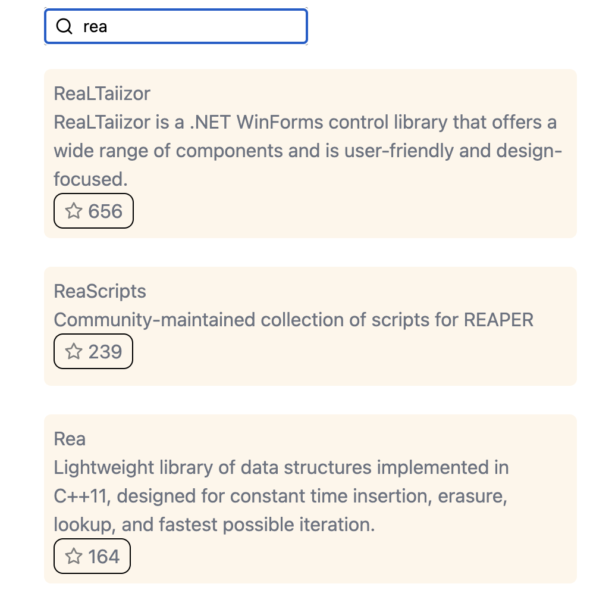
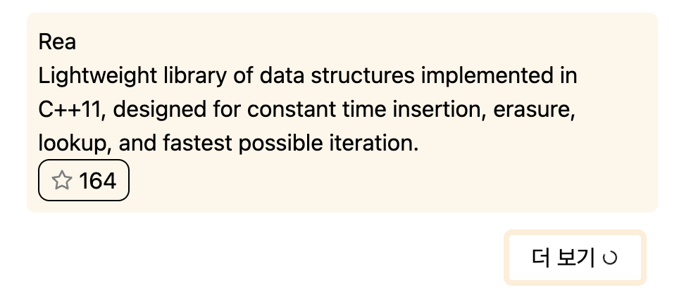
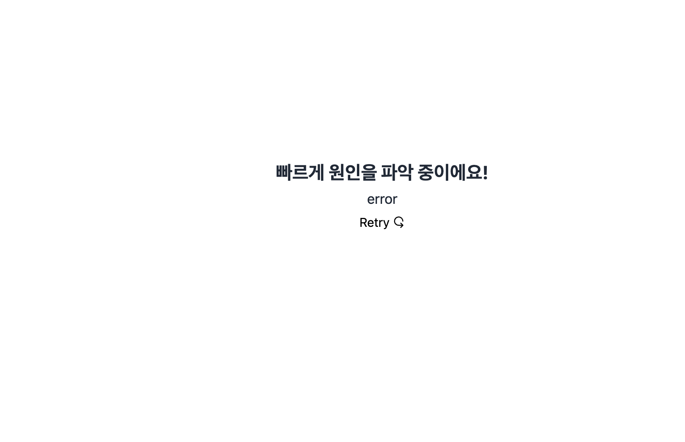

## 과제 실행 방법

1. https://assignment-indol-kappa.vercel.app/ (사이트에서 바로 결과물을 확인해보세요!)

2. 저장소를 clone한 뒤, `npm start`로 프로젝트를 실행합니다.

## 🔥 과제에 대한 설명

#### 과제에서 느낀 점

- graphql과 relay를 처음 사용해보면서 러닝 커브가 낮지 않았지만, query와 fragment를 기반으로 타입과 결합되어있다는 점과, relay compiler의 사전 에러 방지가 매력적이라고 생각이 들었습니다.

- 컴포넌트와 데이터 로직을 한 곳에 작성하여 규모가 큰 프로젝트에서 유용하게 사용할 수 있을 거라 생각합니다.

- 이번 과제에서는 lazyLoad를 사용하였지만, preloadQuery를 사용하면 component 렌더링 이전에 데이터를 미리 요청할 수 있다는 점이 다른 라이브러리와 비교했을 때 장점이라고 생각이 들었습니다.

#### 구현 요구사항

- [x] Query.search 필드 리졸버를 이용한 레포지토리 검색

- [x] `input` 폼을 이용한 검색
- [x] 검색 결과 페이지네이션(cursor based pagination)

- [x] 아래 Mutation을 이용하여 검색된 레포지토리에 스타 추가/제거 토글 버튼
  - optimistic UI를 이용하여 즉시 반영되도록 만들었습니다.

##### 과제에는 없지만 추가 구현한 기능들

- transition을 사용하여 검색 결과를 `refetch`할 때 ui blocking을 없앴습니다.

- 유저에게 검색 결과 데이터를 받아오고 있다는 것을 알려주기 위해서, transition이 일어나고 있을 경우, 컨텐츠들이 회색으로 표현됩니다.
  

- 더 보기 버튼을 클릭할 시에, 로딩스피너가 추가됩니다.
  

- 검색 중에 에러가 발생한 경우, 에러 메세지와 retry 버튼을 보여줍니다.
  - `REACT_APP_GITHUB_AUTH_TOKEN` 환경변수를 변경하여 error ui를 확인할 수 있습니다.

